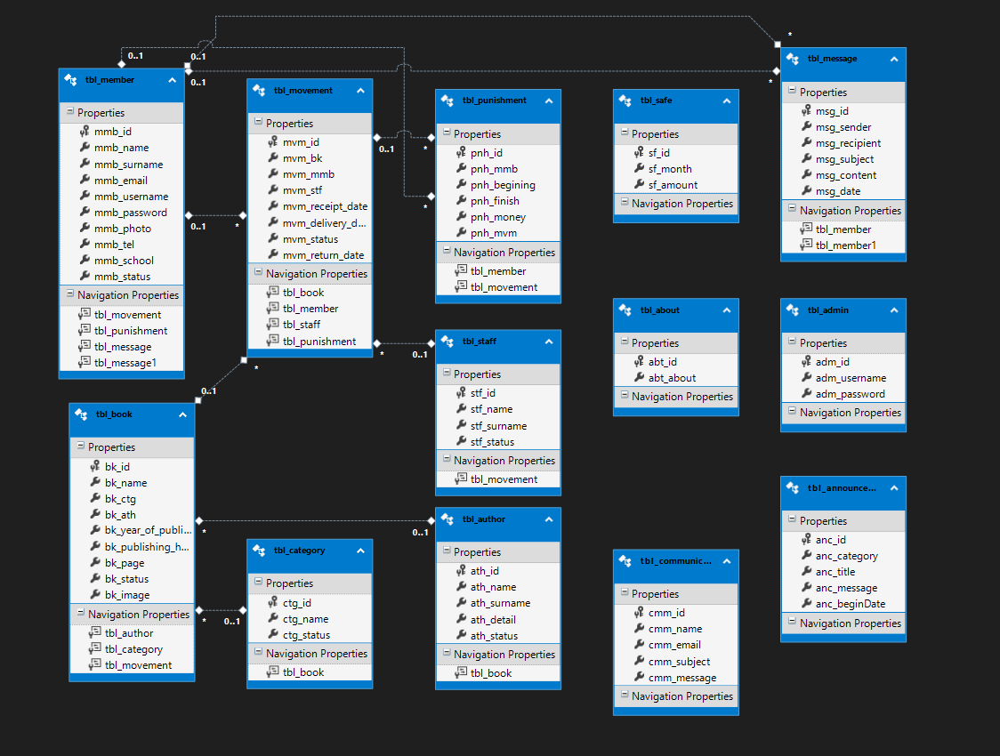

# Mvc5 ile 3 Panelli Kütüphane Yönetim Sistemi

## Proje Hakkında

Bu proje, bir kütüphanedeki kitapların, üyelerin ve işlemlerin yönetimini sağlayan üç panelli bir ASP.NET MVC 5 uygulamasıdır. **Admin**, **kullanıcı** ve **misafir** modüllerini içeren sistem, çeşitli işlevler ve istatistiklerle donatılmıştır.

## Özellikler

### Kullanıcı Modülü
- Kullanıcılar sisteme giriş yapabilir, bilgilerini güncelleyebilir.
- Kullanıcı profilleri üzerinden ödünç alma geçmişi görüntülenebilir.
- Diğer Kullanıcılara mesaj atabilir veya onlardan gelen mesajları görüntüleyebilir.

### Admin Modülü
- Yönetim paneli aracılığıyla kitap, kategori, yazar, üye ve personel yönetimi.
- Ödünç verme ve iade işlemlerini yönetme.
- İstatistikler modülü ile kitaplar ve işlemler hakkında raporlama.
- Duyuru oluşturup tüm öğrencilere bildirme.
- LINQ Kartlar bölümü ile istatistikleri kartlar formatında görebilir.
- Admin panelinde hızlı erişim butonları.

### Misafir Modülü
- Misafir kullanıcılar kitap kataloglarını görüntüleyebilir ve genel kütüphane bilgilerine erişebilir.

## Teknolojiler

- **ASP.NET MVC 5**: Uygulama için anahtar framework.
- **Entity Framework**: Veritabanı işlemleri için kullanılan ORM.
- **Bootstrap**: Responsive arayüz ve tasarım için.
- **LINQ**: Veritabanı sorgularını yönetmek için.

## Proje Resimleri
Aşağıda projeye ait bazı ekran görüntüleri bulunmaktadır:

